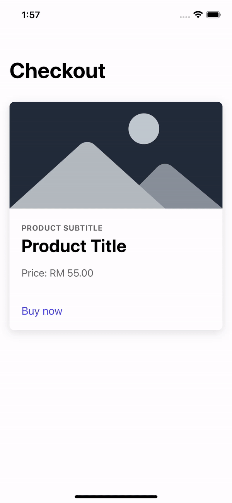

<div align="center">
  <a href="https://ionicframework.com/docs/react">
    
  </a>
  <a href="https://react.dev/">
    
  </a>
</div>

---

<div align="center">
  <div>
    
  </div>
  <b>Preview</b>
</div>

### Requirements
Make sure you have following tools installed:
1. `yarn` or `npm`
2. `node` version `>= 18.x.x`
3. `ionic` version `>= 7.x.x`

## Plugins
1. `cordova-plugin-inappbrowser`
2. `capacitor`
3. `typescript`

## Run example
1. Run [api](./api) on your local. 
    - Follow it's instructions on `readme` to run.
2. Run ionic server:
    ```bash
    yarn dev
    or 
    npm run dev
    ``` 
3. Run on simulator/device:
    ```bash
    // iOS:
    yarn run:ios
    or 
    npm run run:ios

    // Android:
    yarn run:android
    or 
    npm run run:android
    ```

